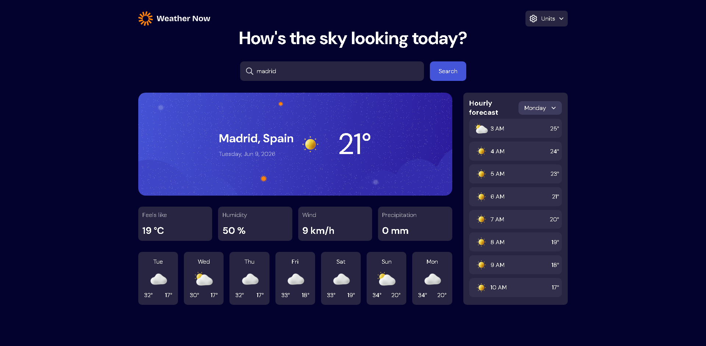
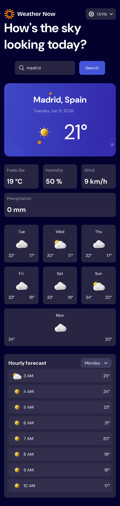

# 🌤️ Weather App

A modern weather application built with React that allows users to search for cities worldwide and view accurate weather forecasts in real time.

## 📸 Preview

### Desktop
<p align="center">
  
</p>


### Mobile

<p align="center">
  
</p>

## ✨ Features

- Search for cities around the world
- Current weather conditions
- Hourly weather forecast
- 7-day weather forecast
- Temperature, humidity, wind speed, and precipitation data
- Switch between Metric and Imperial units
- Responsive design for desktop and mobile devices
- Dynamic weather icons based on weather conditions

## 🛠️ Built With

- React
- JavaScript
- Styled Components
- Open-Meteo Forecast API
- Open-Meteo Geocoding API

## 🚧 Challenges

One of the main challenges during development was handling dates and time zones correctly. Since weather data is returned based on the selected city's local time, special attention was required to ensure that hourly and daily forecasts were displayed accurately across different regions.

This project also helped strengthen my understanding of:

- React state management
- API integration
- Conditional rendering
- Array methods such as `map()`, `findIndex()`, and `slice()`
- Responsive layouts using Flexbox and CSS Grid
- Date and time manipulation in JavaScript

## 🚀 Installation

Clone the repository:

```bash
git clone https://github.com/BernardoWE/weather-app.git
```

Navigate to the project folder:

```bash
cd weather-app
```

Install dependencies:

```bash
npm install
```

Start the development server:

```bash
npm run dev
```

## 🌎 API Reference

This project uses the Open-Meteo APIs:

- Weather Forecast API
- Geocoding API

## 🔮 Future Improvements

- Automatic city search while typing
- Save favorite locations
- Weather alerts
- Dark mode
- Extended forecast information

## 👨‍💻 Author

Bernardo Augusto

GitHub: https://github.com/BernardoWE

LinkedIn: https://linkedin.com/in/bernardo--augusto
